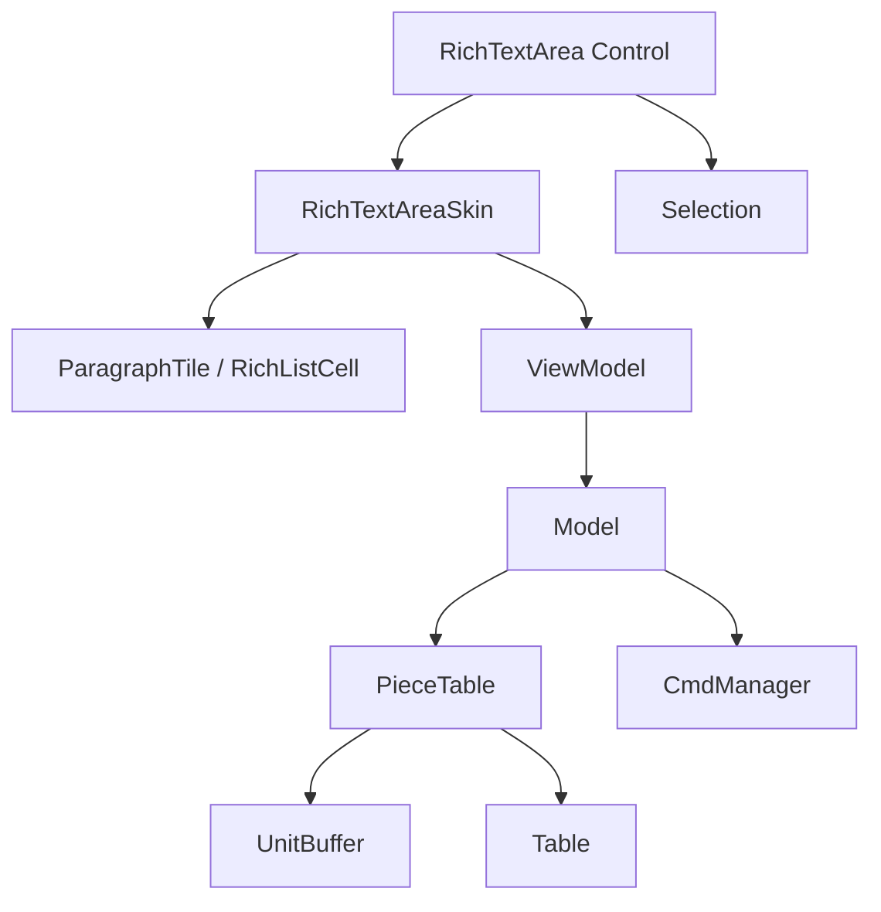
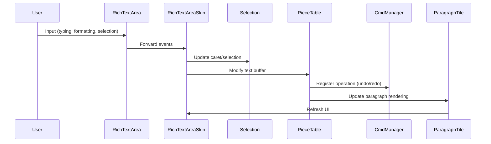
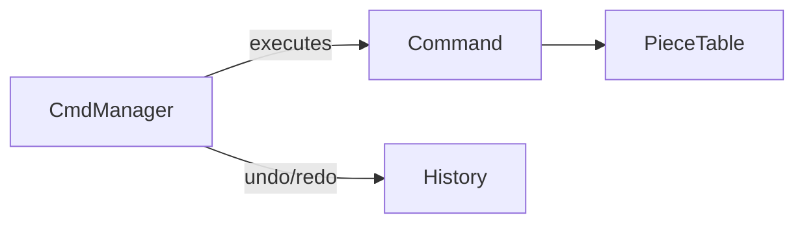

# RichTextArea Architecture

This document provides an overview of the architecture of the **RichTextArea** component.

---

## Architecture Layers

### 1. Presentation Layer (JavaFX UI)
- **RichTextArea**: Main control class (extends `Control`)
- **RichTextAreaSkin**: Custom skin (extends `SkinBase`) handling layout & rendering
- **ParagraphTile**, **RichListCell**, **BackgroundColorPath**, **IndexRangeColor**: Visual components for paragraph rendering, background highlights, and list integration
- **CSS + Properties**: Styling and configuration

### 2. ViewModel Layer
- **Selection**: Manages caret position and selection ranges
- **Paragraph management**: Coordinates how text blocks are represented
- **Factories**  
  - `DefaultLinkCallbackFactory`: Handles hyperlink callbacks  
  - `DefaultParagraphGraphicFactory`: Provides paragraph-level graphics

### 3. Model Layer
- **Piece Table Implementation** (efficient text editing model)  
  - `PieceTable`: Core structure for managing text insertions/deletions  
  - `UnitBuffer`: Stores immutable text units  
  - `Table`: Indexing and mapping between original/edited text
- **Undo/Redo System**  
  - `CmdManager`: Manages commands and undo/redo stacks  

### 4. Action Layer
The **Action Layer** provides **abstraction and extensibility** — developers can register custom actions or override existing ones without touching the model or UI internals.

- **Action** → Represents an executable command, such as `Bold`, `Italic`, `InsertImage`, or `Undo`
- **ActionManager** → Central registry to get different types of `Action` instances
- **Integration with CmdManager** → Each executed action is wrapped as a `Command` to support undo/redo

### 5. Utilities
- **SmartTimer**: Scheduled UI and background tasks
- **Tools**: Helper utilities for formatting, validation, etc.
- **Extensibility Hooks**: Factories & utilities for customization

---

## High-Level Architecture Diagrams

### Component Architecture

### Data Flow

### Undo/Redo Subsystem

