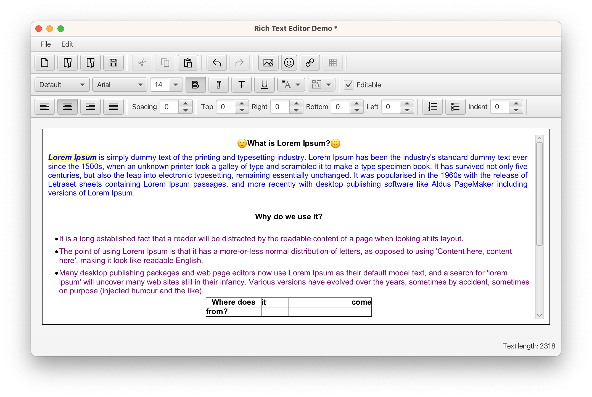

[](https://gluonhq.com)

[](https://github.com/gluonhq/rich-text-area/actions/workflows/build.yml)
[](https://search.maven.org/#search|ga|1|com.gluonhq.rich-text-area)
[](https://opensource.org/licenses/GPL-3.0)
[](https://javadoc.io/doc/com.gluonhq/rich-text-area)

# The Rich Text Area Project

Gluon presents a new JavaFX control, created with Java and JavaFX standard APIs, called the `RichTextArea` control.
RichTextArea is a text input control which provides rich text features along with emoji, and non-text objects like images, tables and hyperlinks.

## Rich Text Area control

Based on the combination of VirtualFlow and multiple TextFlow controls, the RichTextArea control has features like:

- Any part of the content can be selected and can have any styling (all font attributes, foreground or background color, …). This can be changed at any time. Selection of caret navigation of words, lines or paragraphs and can be done via mouse and keyboard platform-standard keys (arrows and key modifiers).
- Any paragraph can be styled with text alignment, line separation, indentation, bulleted or numbered list.
- Has support for non-text nodes like images that can be added at any point, even via drag and drop
- Has support for event handling of hyperlinks and image custom actions
- Copy/cut/paste, unlimited undo and redo are supported.
- Save/open documents to persist and restore the content with its different styles.
- Inline table support
- Emoji support
- … (and more to come)



### License

The RichTextArea control is available for free under the GPLv3 license. If you create an Open Source application, you can use our software for free.
[Contact us](https://gluonhq.com/contact-sales/) for more information on commercial usage of the RichTextArea.

### Usage

To use the RichTextArea control in your project add the following dependency:

```
<dependency>
    <groupId>com.gluonhq</groupId>
    <artifactId>rich-text-area</artifactId>
    <version>1.2.0</version>
</dependency>
 ```

and then simply create an instance and add it to your JavaFX application:

```
@Override
public void start(Stage stage) {
    RichTextArea editor = new RichTextArea();
    BorderPane root = new BorderPane(editor);
    Scene scene = new Scene(root, 800, 600);
    stage.setScene(scene);
    stage.show();
}
```

### Samples

Multiple samples, from basic to full-featured can be found in the [samples folder](samples).

## Issues and Contributions

Issues can be reported to the [Issue tracker](https://github.com/gluonhq/rich-text-area/issues)

Contributions can be submitted via [Pull requests](https://github.com/gluonhq/rich-text-area/pulls),
providing you have signed the [Gluon Individual Contributor License Agreement (CLA)](https://cla.gluonhq.com).

Follow [contributing rules](https://github.com/gluonhq/rich-text-area/blob/main/CONTRIBUTING.md) for this repository.

## Design Notes

See [documentation](https://github.com/gluonhq/rich-text-area/blob/main/README-impl.md) for more information.
