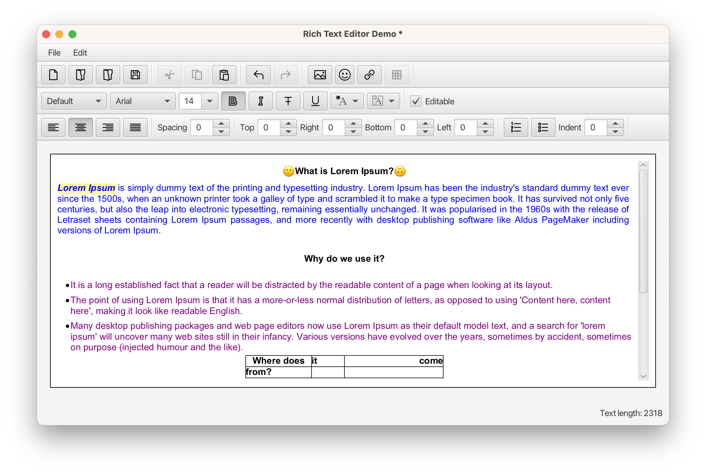

# The Rich Text Area Samples

## SimpleRTADemo

The most simple use case of the Rich Text Area control.

### Usage

To run this sample, using Java 17+, do as follows:

```
mvn javafx:run -fsamples -Dmain.class=com.gluonhq.richtextarea.samples.SimpleRTADemo
```

## SimpleRTAWithTextDemo

A simple use case of the Rich Text Area control, showing some text and highlighting some keywords programmatically.

### Usage

To run this sample, using Java 17+, do as follows:

```
mvn javafx:run -fsamples -Dmain.class=com.gluonhq.richtextarea.samples.SimpleRTAWithTextDemo
```

## SimpleRTAWithListsDemo

A simple use case of the Rich Text Area control, showing lists with different indentation, crated programmatically.

### Usage

To run this sample, using Java 17+, do as follows:

```
mvn javafx:run -fsamples -Dmain.class=com.gluonhq.richtextarea.samples.SimpleRTAWithListsDemo
```

## SimpleRTAWithEmojiDemo

A simple use case of the Rich Text Area control, showing text and emojis.

### Usage

To run this sample, using Java 17+, do as follows:

```
mvn javafx:run -fsamples -Dmain.class=com.gluonhq.richtextarea.samples.SimpleRTAWithEmojiDemo
```

## RichTextEditorDemo

A complete use case of the Rich Text Area control as a RichTextEditor. 
The sample includes a number of menus and toolbars that allow the user to apply actions over selections or at the caret location.

### Usage

To run this sample, using Java 17+, do as follows:

```
mvn javafx:run -fsamples
```



